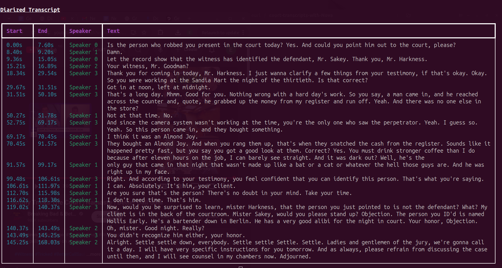

# 🎙️ Generating Court Transcripts with Deepgram

This repository contains the companion code for the article [**Generating Court Transcriptions with Deepgram**](https://neurlcreators.substack.com/p/generating-court-transcriptions-with) on [**The Neural Blueprint**](https://neurlcreators.substack.com/).
It demonstrates how to use **Deepgram’s Nova-3** model to produce transcripts enriched with **speaker diarization** and **timestamps**, essential features for legal and courtroom applications.

---

## 📦 Installation

Install the required dependencies:

```bash
pip install deepgram-sdk rich
```

---

## ▶️  Usage

You can transcribe either a local audio file or a remote URL.
This repository includes a sample file (`Better_Call_Saul.mp3`) you can try right away.

```bash
python main.py "Better_Call_Saul.mp3" --api_key YOUR_DEEPGRAM_API_KEY
```


## 📄 Output Example



You’ll get a neatly formatted transcript showing **who spoke** and **when**, making it ideal for court proceedings, depositions, and legal record-keeping.
